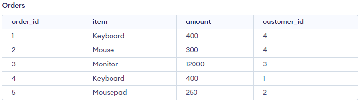

# SQL Exercises
Exercise 1

## 2nd Highest Amount of Orders

Select the second highest amount of orders.

### Database:

<p align="center">

</p>

### Solution

Exclude highest number by applying `max`, then apply `max` again on the excluded set.

```sql
SELECT max(amount) FROM Orders WHERE amount NOT IN (SELECT MAX(amount) FROM orders);
```
