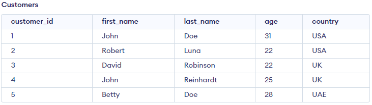

# SQL Exercises
Exercise 2

## Oldest Customers from each Country

Using age, select the oldest customers from each country.

### Database:

<p align="center">

</p>

### Solutions

#### Solution 1

Use `GROUP BY` keyword with `max` function.

```sql
SELECT MAX(age),country
FROM Customers
GROUP BY country;
```
